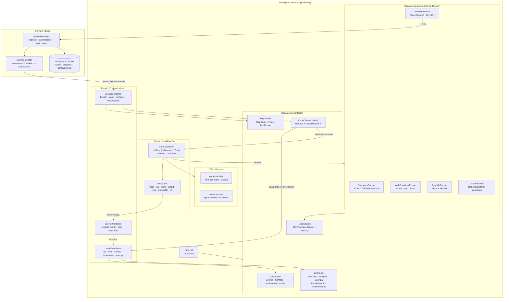

# Arquitectura — CodeQuest (plataforma gamificada de aprendizaje técnico)

> Entregable 1: arquitectura del sistema, estructura de carpetas y decisiones clave.
> Estado: diseño aprobado para implementación. Fase 0–1 en curso (ver `ROADMAP.md`).

---

## 1. Principios rectores

1. **El contenido es datos, no código.** Una lección es un JSON validado por schema. Nadie escribe React para añadir una lección. Esto es lo que permite escalar a cientos de lecciones y traducirlas sin tocar la app.
2. **Ejecución detrás de una interfaz única (`Runner`).** Sandpack, WebContainers, Pyodide, un runner remoto y el simulador de CLI implementan el mismo contrato. La UI no sabe cuál está corriendo.
3. **El hilo de UI es sagrado.** El "juice" (combos, partículas, shake) corre a 60fps. Parseo, linting y tests van a Web Workers. Un análisis de sintaxis nunca puede tragarse un keystroke.
4. **La gamificación es una capa de observación, no de acoplamiento.** El store escucha eventos (`keystroke`, `rule:failed`, `step:passed`) y deriva XP/combo/logros. El motor de evaluación no sabe qué es el XP.
5. **Bilingüe desde el día 0, no como retrofit.** Si el ES/EN no está en el schema desde la primera lección, se paga 10x después.

---

## 2. Diagrama de componentes



**Flujo de un keystroke** (la ruta caliente, la que hay que mantener barata):

```
tecla → Monaco onChange
      ├─→ useGameStore.registerKeystroke()   [síncrono, ~0 coste]  → combo, contador, FX
      └─→ RuleDispatcher.scheduleTypeCheck() [debounce 120ms]
              → parser.worker (AST/lint)
              → reglas con when:"type"
              → RuleResult[] → decorations Monaco (shake rojo) + energy--
```

---

## 3. Estructura de carpetas

```
cod-ing/
├── content/                          # ⚠️ CONTENIDO = DATOS. Sin lógica aquí.
│   ├── schema/
│   │   └── lesson.schema.json        # generado desde Zod (para $schema en VSCode)
│   ├── lessons/
│   │   ├── frontend/
│   │   │   ├── html/  css/  javascript/  typescript/  react/  vue/  nextjs/
│   │   ├── backend/
│   │   │   ├── node/  python/  go/  sql/  api-design/
│   │   └── devops/
│   │       ├── bash/  linux/  docker/  compose/  ci-cd/  nginx/  k8s/
│   ├── tracks/                       # metadatos de ruta: orden, prerequisitos, boss lessons
│   │   ├── frontend.track.json
│   │   ├── backend.track.json
│   │   └── devops.track.json
│   └── achievements/
│       └── achievements.json         # catálogo bilingüe + triggers
│
├── messages/                         # i18n de la UI (next-intl). NO contenido de lecciones.
│   ├── es.json
│   └── en.json
│
├── src/
│   ├── app/
│   │   ├── [locale]/
│   │   │   ├── layout.tsx            # NextIntlClientProvider + shell
│   │   │   ├── page.tsx              # dashboard / mapa de mundos
│   │   │   ├── tracks/[track]/page.tsx
│   │   │   └── play/[track]/[lesson]/page.tsx   # ← la pantalla de juego
│   │   ├── api/
│   │   │   ├── run/route.ts          # proxy a Piston/Judge0 (rate-limited)
│   │   │   ├── progress/route.ts
│   │   │   └── content/[...slug]/route.ts
│   │   └── globals.css
│   │
│   ├── components/
│   │   ├── layout/          GameShell · LeftPanel · RightPanel · OutputDock
│   │   ├── editor/          CodeCanvas · PowerModeFX · DamageDecorations · FileTree
│   │   ├── terminal/        XtermPane · useXterm · ansi.ts
│   │   ├── preview/         DomPreview (iframe sandbox) · SandpackPreview
│   │   ├── gamification/    XpBar · LevelBadge · EnergyBar · ComboCounter
│   │   │                    AchievementToast · KeystrokeCounter · ConfettiLayer
│   │   ├── lesson/          StepCard · HintCard · TestResultList · InterviewBrief
│   │   └── ui/              primitivas (Button, Card, Panel, Tooltip)
│   │
│   ├── lib/
│   │   ├── content/
│   │   │   ├── types.ts              # tipos TS derivados de Zod
│   │   │   ├── lesson.schema.ts      # ← FUENTE DE VERDAD (Zod)
│   │   │   ├── loader.ts             # carga + valida + cachea
│   │   │   └── localize.ts           # pick(LocalizedText, locale) con fallback
│   │   ├── engine/
│   │   │   ├── dispatcher.ts         # orquesta reglas por fase
│   │   │   ├── validators/
│   │   │   │   ├── regex.ts  ast.ts  dom.ts  stdout.ts
│   │   │   │   ├── http.ts   unit-test.ts
│   │   │   │   ├── dockerfile.ts     # parser + reglas de buenas prácticas
│   │   │   │   └── cli-transcript.ts
│   │   │   └── index.ts              # registry: RuleKind → Validator
│   │   ├── runners/
│   │   │   ├── types.ts              # interfaz Runner (contrato único)
│   │   │   ├── sandpack.ts  webcontainer.ts  pyodide.ts
│   │   │   ├── remote.ts             # Piston/Judge0 vía /api/run
│   │   │   ├── cli-sim/              # FS virtual + comandos docker/kubectl/git
│   │   │   └── factory.ts            # RuntimeSpec → Runner
│   │   ├── game/
│   │   │   ├── xp.ts                 # curvas de nivel, cálculo de XP
│   │   │   ├── combo.ts              # ventana, decay, multiplicador
│   │   │   └── achievements.ts       # evaluación de triggers
│   │   └── db/                       # Drizzle: schema.ts, queries.ts
│   │
│   ├── stores/
│   │   ├── useGameStore.ts           # ← Entregable 3
│   │   ├── useLessonStore.ts
│   │   └── useRunnerStore.ts
│   │
│   ├── workers/
│   │   ├── parser.worker.ts
│   │   └── assert.worker.ts
│   │
│   ├── i18n/
│   │   ├── routing.ts                # locales: ['es','en'], defaultLocale: 'es'
│   │   └── request.ts
│   └── middleware.ts                 # next-intl middleware
│
├── scripts/
│   ├── generate-json-schema.ts       # Zod → content/schema/lesson.schema.json
│   ├── validate-content.ts           # CI: valida TODAS las lecciones
│   └── check-i18n-parity.ts          # CI: falla si falta una traducción
│
├── docs/
│   ├── ARCHITECTURE.md               # este archivo
│   ├── ROADMAP.md
│   └── AUTHORING.md                  # guía para crear lecciones
└── tests/
```

---

## 4. Decisiones de arquitectura (ADR compactos)

### ADR-01 · Bilingüe co-locado en la lección, separado en la UI

- **UI chrome** (botones, menús, toasts) → `messages/{es,en}.json` con `next-intl`. Es el caso de uso estándar.
- **Contenido de lecciones** → objeto `LocalizedText = { es, en }` **dentro del mismo JSON de la lección**, no en archivos paralelos `lesson.es.json` / `lesson.en.json`.

**Por qué:** los archivos paralelos se desincronizan en cuanto añades un paso. Con `LocalizedText` inline, el schema Zod *obliga* a que ambos idiomas existan al añadir un paso — es imposible mergear una lección a medio traducir. El coste (JSON más verboso) es real pero se paga una vez; la deuda de contenido desincronizado se paga para siempre.

**Cambio de idioma sin perder progreso:** el progreso se indexa por `lessonId` + `stepId`, que son *invariantes de locale*. Cambiar el idioma solo re-renderiza texto; el buffer del editor, el combo y el XP viven en stores que no conocen el locale.

### ADR-02 · Interfaz `Runner` única

```ts
interface Runner {
  readonly kind: RuntimeKind;
  boot(spec: RuntimeSpec, files: FileMap): Promise<void>;
  writeFile(path: string, content: string): Promise<void>;
  run(cmd?: string): Promise<RunResult>;   // { exitCode, stdout, stderr, artifacts }
  onOutput(cb: (chunk: OutputChunk) => void): Unsubscribe;
  reset(): Promise<void>;
  dispose(): void;
}
```

Cinco implementaciones. La UI (`OutputDock`) solo decide **iframe vs xterm** según `runner.kind`. Añadir Rust mañana = una implementación nueva, cero cambios en la UI.

### ADR-03 · Docker/K8s: simulación determinista, no ejecución real

**Esto es lo más importante de todo el documento.** No existe forma de correr un demonio de Docker o un cluster de Kubernetes dentro de un navegador. Cualquier diseño que lo asuma se estrella en la semana 3.

La estrategia de tres capas para DevOps:

| Capa | Qué valida | Cómo |
|---|---|---|
| **Estática** | El Dockerfile/YAML/nginx.conf está bien escrito y sigue buenas prácticas | Parser propio + reglas (`dockerfile-lint`: orden de capas para cache, usuario no-root, multi-stage, `.dockerignore`) |
| **Simulada** | El usuario sabe *qué comandos* ejecutar y en qué orden | `CliSimRunner`: FS virtual + tabla de comandos con salidas pregrabadas y realistas, incluyendo salida de error si el comando es incorrecto |
| **Real (Node/bash)** | Scripts de bash, npm, git, servidores Node | `WebContainerRunner` — esto sí es un Linux real en WASM |

La simulación no es un atajo pedagógico: para "¿en qué orden pones `COPY package.json` y `COPY . .` para aprovechar la caché?" la validación estática es *mejor* que ejecutar Docker, porque puede explicar **por qué** falla la caché.

### ADR-04 · Cross-origin isolation aislada por ruta

WebContainers exige `COOP: same-origin` + `COEP: require-corp`. Aplicarlo globalmente rompe fuentes de Google, imágenes externas y cualquier embed. Solución: los headers se aplican **solo** bajo `/play/(backend|devops)/**` vía `next.config.ts` `headers()`, y los assets de esas rutas se sirven self-hosted. Sandpack y Pyodide no requieren aislamiento y viven sin restricción.

> Nota comercial a validar antes de lanzar: WebContainers (StackBlitz) requiere licencia para uso comercial. El diseño con `Runner` intercambiable es precisamente el seguro contra esto — si la licencia no encaja, `WebContainerRunner` se sustituye por `RemoteRunner` sin tocar UI ni contenido.

### ADR-05 · Validation-on-type sin bloquear el hilo

- Debounce de **120ms** desde el último keystroke (por debajo del umbral de percepción, por encima del ruido de tecleo).
- El parseo va a `parser.worker` (web-tree-sitter para AST multi-lenguaje; ESLint solo para JS/TS).
- El worker devuelve diagnósticos → `RuleDispatcher` los cruza con las reglas `when:"type"` del paso actual → Monaco `deltaDecorations` pinta la línea con `.line-damage` (shake + glow rojo).
- **Regla anti-frustración:** una regla `when:"type"` con `severity:"damage"` no dispara durante los primeros 800ms de un token incompleto. Nadie debe recibir daño por estar a medio escribir `func`.

### ADR-09 · La terminal es una capacidad, no un runtime — y por eso no dependemos de WebContainers

**Decisión tomada.** Verificado en la documentación oficial: la licencia de WebContainers
es obligatoria para *uso en producción en un contexto comercial*; los prototipos están
exentos y no hay API key ni registro de dominio. Aun así se decidió **eliminar la
dependencia ahora**, antes de que hubiera contenido atado a ella.

**Lo que hizo posible eliminarla** fue corregir un error de modelado del ADR-07: allí se
trataba la terminal como un *tipo de runtime*, lo que forzaba a elegir entre consola
(WebContainers) y vista previa (Sandpack). Pero el schema ya tenía `runtime.terminal`
como campo **ortogonal** a `runtime.kind`. Explotar esa ortogonalidad da la combinación
que se creía imposible:

```jsonc
"runtime": {
  "kind": "sandpack",          // React se renderiza de verdad
  "terminal": { "enabled": true, "allowedCommands": ["npm", "cd", "ls"] }
}
```

La `Shell` se extrajo de `CliSimRunner` a `cli-sim/shell.ts` y se compone junto a
cualquier runner. Los archivos que un comando genera se propagan al runner de preview
(`useRunnerStore.runCommand`), que es lo que hace que `npm create vite` seguido de editar
`App.jsx` funcione de verdad. Sin esa propagación la terminal sería decorativa.

**Lo que se gana:** cero dependencias de licencia, ejecución instantánea (no hay
`npm install` real de medio minuto), determinismo total y tests en Node.

**Lo que se pierde, y hay que decirlo en la lección:** no es Node real. No se puede
instalar un paquete arbitrario de npm — solo existen las plantillas de
`npm-scenario.ts` (react, vue, vanilla). Para una lección guiada cuyo objetivo es
aprender el comando y la estructura del proyecto, alcanza. `react-04` lo advierte
explícitamente en su enunciado en lugar de fingir lo contrario.

**Consecuencia sobre COOP/COEP:** al no quedar ninguna lección con
`kind: "webcontainer"`, `next.config.ts` no genera ninguna cabecera de aislamiento. La
lógica sigue en su sitio y se reactivará sola el día que exista una lección que lo pida.

**Si algún día hace falta Node de verdad** (instalar paquetes arbitrarios, servidores
backend), las opciones siguen siendo licenciar WebContainers o levantar contenedores
efímeros propios. El contrato `Runner` mantiene esa puerta abierta sin tocar contenido.

### ADR-07 · La terminal interactiva mueve WebContainers al centro del producto

> ⚠️ **Revertido por el ADR-09.** Se conserva porque documenta por qué se creyó que
> WebContainers era imprescindible: se había modelado la terminal como un tipo de
> runtime en lugar de como una capacidad. El error de modelado es la parte reutilizable.

**Contexto.** Requisito nuevo: el usuario debe poder abrir una consola e instalar
frameworks y herramientas él mismo (`npm install`, `npm create vite@latest`), no que
la plataforma lo prepare por detrás.

**Consecuencia sobre ADR-04.** Sandpack empaqueta React/Vue en el navegador pero **no
tiene npm**: no hay forma de instalar un paquete arbitrario ni de teclear un comando.
Solo WebContainers ofrece un Node y un shell reales. Eso significa que las lecciones de
framework de frontend también necesitan cross-origin isolation, y los headers dejan de
aplicarse solo a `/play/(backend|devops)/**`.

Como aplicarlos globalmente rompería recursos externos, la regla pasa a ser **por
lección y no por track**: el layout de `/play/**` lee `lesson.runtime.kind` y solo las
rutas cuyo runtime sea `webcontainer` reciben COOP/COEP. Frontend queda partido:

| Tipo de lección | Runtime | Aislamiento |
|---|---|---|
| HTML/CSS/JS puro | `dom` | no |
| React/Vue sin instalación | `sandpack` | no |
| React/Vue con terminal y npm | `webcontainer` | **sí** |

**Consecuencia sobre el riesgo.** La licencia comercial de WebContainers pasa de ser un
riesgo del track de backend a ser un riesgo del producto entero. `RemoteRunner` no es
sustituto aquí: un runner remoto ejecuta un fichero y devuelve stdout; no da una sesión
de shell interactiva con FS persistente. Si la licencia no encaja, las alternativas
reales son contenedores efímeros propios en servidor (coste e infraestructura muy
superiores) o renunciar a la instalación interactiva y quedarse en Sandpack.

**Decidir antes de escribir contenido que dependa de ello.** Las lecciones marcadas
`runtime.kind: "webcontainer"` son las que quedarían huérfanas.

### ADR-08 · El workspace es mutable: `files` es el estado inicial, no la lista final

**Contexto.** Requisito nuevo: árbol de directorios navegable, con archivos que el
usuario crea y con lo que generen las herramientas (`npm create vue` escribe decenas de
archivos), para que el ejercicio se parezca a un proyecto real.

**Decisión.** `workspace.files` pasa a significar "con qué arranca el ejercicio". La
verdad del FS durante la sesión la tiene el runner, y el árbol es su reflejo.

Campos nuevos en el schema:

```jsonc
"workspace": {
  "files": [ /* estado inicial */ ],
  "entry": "src/main.js",
  "allowCreate": true,          // el usuario puede crear archivos
  "allowDelete": false,         // …y borrarlos
  "protectedPaths": ["tests/"]  // ni renombrar ni borrar: sostienen la evaluación
}
```

**Sincronización.** Es el punto delicado y donde se irá el tiempo de la Fase 3.5: el
FS del runner es la fuente de verdad, el store se suscribe a sus cambios, y las
escrituras del editor van al runner (no al revés). Hacerlo bidireccional sin un dueño
claro produce archivos fantasma en cuanto un comando y el editor tocan lo mismo.

**Coste.** La evaluación se complica: una regla `regex-must` sobre `index.js` ya no
puede asumir que ese archivo existe. Los validadores necesitan un caso "archivo
ausente" con mensaje propio, en lugar de fallar con un error genérico.

**Rendimiento.** `node_modules` puede ser 300 MB y decenas de miles de entradas. El
árbol lo trata como nodo colapsado especial y no lo recorre nunca; sin esa excepción,
el primer `npm install` congela la pestaña.

### ADR-06 · Anti-cheat mínimo del combo

El combo cuenta keystrokes *productivos*: se ignoran teclas de navegación, y un pegado (`paste`) de más de 40 caracteres rompe el combo en vez de dispararlo. Sin esto, mantener la tecla `a` pulsada da "Coding Spree!" y la mecánica pierde todo su significado.

### ADR-10 · El DOM se evalúa en un espejo inerte, no en el marco de vista previa

**Contexto.** El runner `dom` ejecuta el código del usuario en un iframe con
`sandbox="allow-scripts"` y sin `allow-same-origin` (ADR-02). Esa combinación le da un
**origen opaco**, que es justo lo que se quería: el código de la lección no puede tocar
`localStorage`, ni las cookies, ni el DOM de la aplicación.

**El problema.** Un origen opaco tampoco se deja leer *desde fuera*:
`iframe.contentDocument` vale `null` desde la ventana anfitriona. El validador
`dom-assert` recibía `document: null` y devolvía `null`, que el motor interpreta —
correctamente — como **pendiente**. Resultado: todas las reglas `dom-assert` de la
plataforma llevaban desde la Fase 2 sin evaluarse nunca en un navegador. Nunca se
pusieron en rojo, así que nada chilló, y los 153 tests de Node no lo veían porque en
jsdom el atributo `sandbox` no se aplica.

**Decisión.** Separar *ejecutar* de *inspeccionar*, con dos iframes:

| | Vista previa | Espejo |
|---|---|---|
| `sandbox` | `allow-scripts` | `allow-same-origin` |
| Ejecuta código | sí | **no** (no se concede) |
| Legible desde el padre | no | sí |
| Visible | sí | `visibility:hidden` |

Al terminar, el puente de consola serializa `document.documentElement.outerHTML` y lo
manda con el aviso `done` — el único momento en que el marco opaco puede enseñar su DOM,
y ya con las mutaciones del script aplicadas. El anfitrión lo vuelca en el espejo y
resuelve la promesa de ejecución solo cuando este ha cargado.

**Por qué `visibility` y no `display:none`.** `getComputedStyle` sobre un árbol sin
layout devuelve valores por defecto: `box-sizing` daría `content-box` y `width` daría
`auto` pase lo que pase. El espejo tiene que ocupar sitio de verdad para poder responder
lo que `css-03` y `css-05` preguntan.

**Por qué las dos concesiones nunca van juntas.** `allow-scripts` + `allow-same-origin`
en el mismo iframe permite que el contenido se quite su propio atributo `sandbox` y
escape. Aquí cada marco recibe exactamente una de las dos, y ninguno puede hacer las dos
cosas.

**Coste.** Un iframe más por ejecución y el `<!doctype html>` reañadido a mano en la
serialización — sin él el espejo renderiza en *quirks mode*, donde `width` ya se comporta
como `border-box` y la lección del modelo de caja se aprobaría sola.

**Guardia.** El E2E de `css-03` recorre la lección entera y comprueba una regla
`dom-assert` de estilo computado a través del sandbox real. Un test de Node no sirve:
en jsdom este fallo no existe.

---

### ADR-11 · SQL se ejecuta contra un PostgreSQL real en el navegador, servido por nosotros

**Contexto.** El track de Backend estaba vacío y ningún runner sabía ejecutar SQL. Las
dos salidas eran un runner remoto —una base efímera por petición, aislada, con su coste
y su superficie de ataque— o meter la base de datos en la pestaña.

**Decisión.** PGlite: PostgreSQL compilado a WebAssembly, corriendo en el cliente. No es
un simulador ni un subconjunto; es el mismo motor, con sus tipos, su planificador y sus
mensajes de error. Que un `GROUP BY` mal escrito falle con el texto exacto que fallaría
en producción **es parte de lo que la lección enseña**.

Pesa: ~18 MB de wasm y datos, y unos 3,5 s de arranque. Se paga una vez por sesión y el
navegador lo cachea; a cambio, cada ejecución posterior es instantánea y local, que es
justo el bucle en el que se itera al aprender SQL. Un runner remoto invierte el reparto:
arranque barato y un viaje de red en cada intento.

**No se puede empaquetar.** `import('@electric-sql/pglite')` a secas revienta en el
navegador con `m.instantiateWasm is not a function`: el paquete trae su propio grafo de
chunks y el reempaquetado le rompe la interoperabilidad del namespace. Se probaron las
dos vías documentadas —pasarle `pgliteWasmModule`/`fsBundle` a mano, y servirlo desde un
CDN— y la que resuelve el problema de raíz es **no dejar que el bundler lo toque**: el
módulo se pide con un `import()` construido en tiempo de ejecución, que no es analizable
estáticamente.

**Servido desde nuestro origen, no desde un CDN.** jsDelivr funciona y es una línea
menos, pero ata cada lección de SQL a que un dominio ajeno esté disponible y sin
bloquear —una condición que ya arrastramos con Sandpack y que no conviene repetir—. Los
archivos se copian de `node_modules` en cada build (`scripts/copy-pglite.ts`, enganchado
a `prebuild`), así que la versión queda clavada a la del `package.json` y **no entran
18 MB de binarios en git**: `public/pglite/` está en `.gitignore`.

**Cada ejecución parte del mismo estado.** La consulta del usuario corre entre `BEGIN` y
`ROLLBACK`. Sin eso, una lección de `INSERT` duplicaría filas en el segundo intento y el
resultado dependería de cuántas veces has pulsado «Ejecutar» — con la evaluación
cambiando de veredicto por debajo.

**Se corrige el resultado, no el texto.** La regla `sql-result` compara el **conjunto de
filas devuelto**. `WHERE precio > 100` y `WHERE NOT precio <= 100` son la misma respuesta
y las dos valen; suspender la segunda sería corregir el estilo disfrazado de corregir el
resultado. Cuando la lección sí quiere una forma concreta —«resuélvelo con un `JOIN`»—
eso se pide con `regex-must`, y así queda explícito en el enunciado. El orden de las
filas no se exige salvo que la regla lo pida: sin `ORDER BY`, Postgres no garantiza
ninguno, y exigirlo sería exigir suerte.

**Guardia.** `tests/sql-lessons.test.ts` ejecuta cada lección de SQL contra un PGlite de
verdad en Node: aplica su esquema, corre la consulta de referencia y la pasa por el
validador. Las filas esperadas de una lección se escriben a mano en el JSON, que es
exactamente el sitio donde se cuela una tilde de más o una fila olvidada; esto es lo que
impide que una lección afirme un resultado que su propia solución no produce.

---

### ADR-12 · Todo paso pide escribir algo, y ninguna lección se bloquea

Dos decisiones que van juntas porque tratan lo mismo: quién manda en la sesión.

**Todo paso es un ejercicio.** Quince de los cincuenta y nueve pasos del temario
terminaban en «lee esto y quédate con la idea». Funcionaban como texto, pero convertían
la pantalla en un libro con un editor decorativo al lado: el usuario avanzaba sin haber
tecleado nada, que es lo contrario de para lo que existe la plataforma. Ahora **todo paso
declara al menos una regla**, y `validate-content.ts` rechaza la lección que no lo haga.
Si un concepto no se puede ejercitar, va dentro del cuerpo de otro paso que sí lo haga.

Convertirlos no fue reescribir el texto: fue encontrar en cada uno la comprobación que ya
estaba implícita. El paso de `NULL` pasa de explicar que `= NULL` no funciona a **pedir la
consulta que lo demuestra**; el de `const` pasa de predecir qué línea lanza a escribir el
`try/catch` que lo imprime; el de rendimiento en React pasa de «anota cuántas veces se
renderiza» a poner ese número en pantalla.

**Consecuencia estructural: solución por paso.** Con un ejercicio por paso, la solución
final ya no verifica los intermedios — la consulta del paso 3 no cumple, ni debe, las
reglas del paso 1. `steps[].solution` guarda el estado que supera **ese** paso, nunca
viaja al cliente y el comprobador de spoilers la trata igual que la solución de la
lección. Los tests la usan para verificar cada promesa por separado; el test global pasó a
comprobar solo las reglas del último paso, que es lo único que la solución final puede
cumplir.

Al añadirlo salió un fallo que llevaba desde la Fase 3 sin detectar: la solución de
referencia de `vue-03` era **solo el bloque `<script>`**, sin `<template>`. Aplicarla
dejaba el componente sin nada que renderizar. Nadie lo vio porque nada la ejecutaba.

**Ninguna lección se bloquea.** El mapa marcaba con candado —y sin enlace— cualquier
lección con prerequisitos sin completar. Quien llega sabiendo que quiere practicar React
entra por React: puede venir de otro sitio, o querer refrescar una sola cosa. Cerrarle la
puerta para proteger un orden que quizá ya cumple es la forma más rápida de que se vaya.

Se sustituye por un aviso que **nombra** las lecciones previas (`Recomendado antes: …`),
no que las cuenta: «requiere 2 lecciones previas» no dice cuáles, y con eso no se puede
decidir nada. El botón «Continuar» sigue recomendando la primera sin huecos detrás —
recomendar es su trabajo, elegir es del usuario.

---

### Sandpack: dos fallos silenciosos arreglados y uno abierto

Al ir a escribir lecciones de Vue apareció que **ninguna lección de framework
funcionaba**, por dos motivos independientes que nadie había visto porque los dos
fallaban callados.

**1. El bundler no recibía plantilla.** `loadSandpackClient` acepta `template`; sin él
infiere, y con solo `files` + `dependencies` inferí­a `static`: servía el entry como script
clásico y todo moría en `Cannot use import statement outside a module`. Ahora se deduce de
las extensiones del workspace (`.vue` → `vue3-cli`, `.jsx/.tsx` → `create-react-app`) y se
añade el andamiaje que el bundler espera —`public/index.html` con el nodo de montaje y un
`package.json`— sin meterlo en el workspace, que es material de la lección y no nuestro.

**2. `dom-assert` nunca se evaluó en React ni en Vue.** Es el mismo caso del ADR-10 en su
segunda forma: el bundle se sirve desde `*.codesandbox.io`, otro origen, así que
`iframe.contentDocument` vale `null` y el validador recibía `document: null` → «pendiente».
Nunca rojo, así que nada chilló desde la Fase 3. La solución es la del ADR-10, ahora
extraída a `runners/mirror.ts` y compartida por los dos runners: el marco de ejecución
manda su HTML y el anfitrión lo vuelca en un iframe legible e inerte.

Dos detalles que costaron encontrar. El mensaje va a **`window.top`**, no a `parent`:
Sandpack anida un iframe dentro de otro, y desde el interior `parent` es la página del
bundler — el espejo recibía su documento, con browserfs y babel dentro. Y la sonda vive en
un template literal, así que un backtick en un comentario cierra la cadena y rompe el
módulo.

**3. React quedó arreglado con lo anterior; Vue no.** Con la plantilla y el espejo en su
sitio, React compila, monta y sus reglas `dom-assert` se evalúan — está cubierto por
`e2e/sandpack.spec.ts`.

Conviene dejar constancia de un diagnóstico equivocado por el camino: se dio por roto el
render de React durante un rato, y lo que fallaba era el **test**. Sustituía el buffer con
`insertText`, que dispara el autocierre de Monaco y dejaba una llave suelta al final; el
sandbox recibía un `SyntaxError` legítimo y no pintaba nada. Se pega desde el portapapeles
y desaparece. La lección: antes de acusar al runtime, comprobar que lo que se le está
dando es lo que se cree.

Vue sí estaba roto de verdad —el bundler compila el `<script>` del SFC y **no la
plantilla**— y se resolvió saliendo de Sandpack (ADR-13).

---

### ADR-13 · Vue corre sin bundler, sin terceros y sin coste

**Contexto.** Sandpack compila el `<script>` de un SFC de Vue 3 y **no la plantilla**: el
componente monta sin función de render y Vue pinta un comentario vacío, avisando solo por
consola. Se probaron las seis plantillas de su bundler contra un SFC mínimo y ninguna
renderiza; `2.19.8` es la última versión publicada del cliente, así que actualizar no era
salida. Las tres lecciones de Vue llevaban desde la Fase 3 sin renderizar nada.

**Decisión.** Hacer por dentro lo que hacía el servicio de fuera:

1. **Compilar el SFC en el navegador** con `@vue/compiler-sfc`, el compilador oficial, con
   `inlineTemplate` — el módulo resultante trae la plantilla ya convertida en render.
2. **Montar el grafo de módulos sobre `import()` nativo**, sin bundler. Cada import se
   reescribe a un marcador `@@ruta@@` y dentro del iframe se crean los blobs en orden de
   dependencia, sustituyendo el marcador por la URL del blob anterior. Eso evita necesitar
   un import map, que tendría que estar completo antes de evaluar el primer módulo.
3. **Servir el runtime de Vue desde nuestro origen**: 168 KB copiados de `node_modules` en
   cada build, como PGlite. Van *inline* en el documento y no como `<script src>` porque el
   iframe tiene origen opaco y cualquier petición suya a nuestro servidor sería
   cross-origin.

**Lo que compra.** Cero red en tiempo de ejecución, cero dependencia de un servicio ajeno y
cero coste — la restricción explícita del proyecto. Si `codesandbox.io` se cae, se bloquea
en una red corporativa o deja de ser gratis, las lecciones de Vue siguen funcionando.

**Y un error de compilación deja de ser una pantalla en blanco.** El mensaje del compilador
llega a la consola tal cual, con archivo, línea y el fragmento señalado:

```
[vue/compiler-sfc] Unexpected token (2:13)
/src/App.vue
1  |  <script setup>
2  |  const roto = ;
   |               ^
```

**Dos trampas encontradas.** `@vue/compiler-sfc` expone una condición `node` que apunta a su
build CJS; el bundler la prefiere y eso arrastra `consolidate` con treinta motores de
plantillas — 43 módulos sin resolver. Hay que importar la ruta explícita del ESM de
navegador. Y el módulo que arranca **no** es `workspace.entry`: ese campo dice qué archivo
se abre en el editor, que en Vue es el componente; importarlo solo lo define, y quien monta
es `main.js`.

**Guardia.** `tests/vue-sfc.test.ts` prueba la compilación y la resolución de rutas en Node
—el compilador es el mismo en los dos sitios— y `e2e/vue.spec.ts` comprueba en el navegador
que la plantilla llega renderizada, que `v-if`/`v-for` funcionan y que el error se enseña.

---

### ADR-13 · Vue se compila y se ejecuta en casa, sin bundler ni terceros

**Contexto.** Sandpack no compila la plantilla de un SFC de Vue 3: se probaron sus seis
plantillas contra un componente mínimo y ninguna renderiza — el componente monta sin
función de render y Vue pinta un comentario vacío. Y `2.19.8` es la última versión
publicada del cliente, así que actualizar no era salida.

**Decisión.** Hacer por dentro lo que hacía el bundler: compilar cada `.vue` con
`@vue/compiler-sfc` —el compilador oficial, que corre en el navegador— y montar el grafo
de módulos a mano sobre `import()` nativo. El runtime de Vue son **168 KB** que se sirven
desde nuestro propio origen, copiados de `node_modules` en cada build.

Los módulos se crean como blobs **dentro del iframe** y en orden de dependencia: cada uno
sustituye sus marcadores `@@id@@` por la URL del blob que ya existe. Así no hace falta un
import map, que tendría que estar completo antes de evaluar el primer módulo.

**Por qué no un CDN.** jsDelivr funciona y es una línea menos, pero ata cada lección a que
un dominio ajeno esté disponible, sin bloquear y sin cambiar de política de precios. Ya
arrastramos esa condición con Sandpack y el proyecto tiene una restricción explícita de
coste cero: sirviéndolo nosotros, la versión queda clavada al `package.json` y no hay nada
más que pueda caerse.

**Guardia.** `tests/vue-sfc.test.ts` comprueba en Node que del SFC sale un módulo **con la
plantilla dentro** —era exactamente el fallo de Sandpack— y `e2e/vue.spec.ts` recorre las
lecciones comprobando que lo que prometen es lo que renderizan, leyendo las soluciones del
propio JSON.

---

### ADR-14 · C# se simula, pero la salida sale del código del usuario

**Contexto.** Ejecutar C# de verdad cuesta decenas de megas de WASM en el cliente o dinero
en el servidor. La restricción del proyecto es **coste cero**, y con ella la simulación
está permitida.

**La línea que decide si una simulación vale algo:**

> La salida se calcula a partir del código del usuario. Nunca se imprime lo que la lección
> espera oír.

Un `dotnet test` que siempre dijera «Superados: 6» sería un decorado, y peor que no tener
nada: daría por buena una solución equivocada.

**Decisión.** Se simula un subconjunto **acotado y declarado**: el cuerpo de un método que
devuelve una expresión. Los operadores de ese subconjunto —`%`, `&&`, `||`, `==`, `!=`,
`<`, `>`, `!`— significan lo mismo en C# y en JavaScript sobre enteros y booleanos, así que
la expresión se analiza con el `acorn` que ya está en el proyecto y se **interpreta sobre
su AST**, sin `eval` y aceptando solo lo que está en la lista. `==` se traduce a `===` a
propósito: `0 == false` sería cierto con el `==` laxo de JavaScript y en C# ni compila.

Los casos de prueba se leen de los `[InlineData]` del fichero de xUnit que el usuario
**tiene abierto en el editor**: lo que se ejecuta es lo que puede leer, no una lista
escondida en el simulador.

Lo que queda fuera —bucles, estado, E/S— se informa como error de compilación en lugar de
inventarse un resultado. Cuando una lección los necesite hará falta un runtime de verdad, y
este módulo no debe estirarse para fingir que lo es.

**Guardia.** `tests/csharp.test.ts` incluye el test que separa el simulador del decorado:
con la solución que olvida la excepción del año 400, **debe fallar** y decir que el caso
roto es el 2000. Si alguien convirtiera esto en un decorado, ese test es el que se pondría
en rojo.

---

### ADR-15 · La pantalla la compone el usuario

**Contexto.** El layout era fijo: tres columnas con anchos de Tailwind y una lista de
tarjetas escrita a mano en `LeftPanel` y `RightPanel`. Cambiar dónde iba algo era editar
JSX. Y se podía entrar en una lección sin ninguna salida visible al mapa — solo el botón
atrás del navegador o editar la URL.

**Decisión.** Las tarjetas dejan de estar escritas en el layout y pasan a ser **datos**:
un registro (`widgets.tsx`) declara cada una una sola vez, y `useLayoutStore` guarda de
cada una su zona, su orden y si se ve. `GameShell` ya no sabe qué hay en cada sitio —
reparte espacio y deja que `WidgetZone` componga.

**Tres zonas, no dos.** `left`, `guide` (con scroll) y `dock` (fija abajo a la derecha).
La distinción entre «con scroll» y «fijo» sobrevive porque la decisión que la creó sigue
siendo buena: el reto y las pruebas se consultan *mientras* se escribe código. Lo que
cambia es que ahora el usuario elige qué va en cada una.

**El editor y la salida no se mueven.** Se redimensionan y nada más. Una pantalla sin
editor no es una pantalla personalizada, es una pantalla rota, y ofrecer la posibilidad de
llegar ahí no es libertad — es una trampa.

**Arrastrar y los botones hacen lo mismo, a propósito.** El arrastre nativo (`dataTransfer`
con un tipo propio) es lo que la gente espera y permite soltar en otra columna sin que las
zonas se conozcan entre ellas. Los botones de subir/bajar/ocultar son la única vía con
teclado y la que funciona en móvil. Que una funcionalidad dependa de un solo gesto es
justo lo que deja fuera a quien no puede hacerlo.

**Ocultar tiene vuelta.** Las tarjetas ocultas aparecen en una bandeja en la barra
superior, a un clic de volver. Esconder algo sin una forma evidente de recuperarlo es una
trampa distinta y peor.

**Los anchos se recortan a un rango.** No se puede dejar una columna invisible ni comerse
la pantalla: `setColumn` aplica mínimos y máximos. Una preferencia que permite romper la
pantalla no es una preferencia, es un bug con permiso.

**Qué se redimensiona.** Las dos columnas laterales (y con ellas el ancho del centro, que
es lo que sobra), el reparto editor/salida, el reparto entre la zona con scroll y la fija,
y **el alto de cada tarjeta**. El alto por tarjeta arranca sin fijar: el navegador reparte
bien por defecto, y obligar a repartir a mano desde el principio sería trabajo sin motivo.
La primera vez que se arrastra se toma el alto que la tarjeta tiene **medido del DOM**, no
un valor por defecto — con uno inventado, el primer paso encogía de golpe una tarjeta de
489 px a 256 en vez de moverla.

**Soltar encima intercambia, no inserta.** El usuario apunta a un hueco concreto y espera
ocuparlo; insertar desplazaba una posición a todas las de abajo, y con columnas de distinta
longitud eso descoloca más de lo que coloca. Soltar en el hueco vacío de una zona sí añade
al final, que es la otra intención posible y no se confunde con la primera.

**El solape era un bug real, no una cuestión de orden.** El contenedor de cada tarjeta
estaba en una columna flex sin `shrink-0`, así que se comprimía por debajo del alto de su
contenido y la tarjeta se dibujaba encima de la siguiente. Es exactamente el mismo fallo
que ya se había arreglado en `Panel`, reaparecido un nivel más arriba al envolver las
tarjetas: **en una columna flex, todo lo que no recorta su contenido tiene que declarar que
no se encoge**.

**Qué se persiste y qué no.** Zona, orden, visibilidad y tamaños van a `localStorage`; el
modo edición no. Es preferencia de interfaz, no progreso, así que no viaja al servidor:
entrar desde otro dispositivo empieza por defecto, que es lo que se espera de un ajuste de
ventana. Y vive fuera del árbol de React por el mismo motivo del ADR-01 — cambiar de
idioma remonta el subárbol y la disposición no debe enterarse.

**Y el centro tiene que poder encoger.** Un elemento flex trae `min-width: auto`: no baja
del ancho mínimo de su contenido, y aquí el contenido es Monaco, que pide mucho. Sin
`min-w-0` en la columna central, ensanchar la derecha subía su ancho de verdad —el store
pasaba de 400 a 550— pero el centro se negaba a ceder y la columna se salía por el borde.
El síntoma era desconcertante: hacia la derecha encogía y hacia la izquierda no pasaba
nada. Por eso el test mide **las dos** columnas: que una crezca sin que la otra encoja no
es redimensionar, es desbordar.

**El divisor invisible, y por qué el test no lo vio.** Los divisores verticales no
declaraban altura. Su única marca visible es un `<span>` absoluto, que no aporta ninguna, así
que medían **cero de alto**: se podían enfocar con Tab y mover con las flechas —por eso las
pruebas pasaban— pero con el ratón no había nada donde pinchar. Redimensionar a lo ancho no
existía en la práctica y ninguna comprobación se quejó.

La lección de método: **un test que solo ejerce el camino de teclado no prueba que la
interfaz exista**. Ahora se mide la caja de cada divisor y se exige que tenga superficie que
agarrar, y hay una prueba que arrastra con el ratón de verdad. `focus()` demuestra que el
elemento está en el DOM; solo el rectángulo demuestra que está en la pantalla.

**Guardia.** `tests/layout-store.test.ts` prueba la aritmética del orden —insertar entre
dos vecinos, no dejar huecos, mover entre zonas— porque es lo que puede romperse en
silencio. `e2e/personalizar.spec.ts` comprueba lo que de verdad se promete: que ocultar,
mover, reordenar y redimensionar **sobrevivan a una recarga**. Una preferencia que se
olvida es peor que no ofrecerla.

### ADR-16 · Las paletas son variables, no hojas de estilo

**Contexto.** Los colores estaban en un único `@theme` de Tailwind: una paleta oscura de
neón, sin alternativa. Quien programa muchas horas suele tener una preferencia fuerte —y a
veces una necesidad— sobre el contraste y la temperatura de lo que mira.

**Decisión.** Cinco paletas (`cyber`, `slate`, `amber`, `matrix`, `paper`), cada una un
bloque `:root[data-theme='…']` que **redefine las mismas ~29 variables** `--color-*`.
Ningún componente sabe que esto existe: todos leen `var(--color-…)` como antes. Añadir una
paleta es añadir un bloque de CSS y una entrada en `THEMES`, nunca tocar un componente.

**Un atributo, no una clase.** Va en `data-theme` del `<html>` porque lo pone un script
síncrono en el `<head>` que lee `localStorage` **antes del primer pintado**. Aplicarlo desde
React llegaría un fotograma tarde: se vería la paleta anterior y luego el cambio. Un
destello de color en cada carga convierte una preferencia en una molestia.

**Restablecer la disposición no cambia la paleta.** Comparten store pero son dos
preferencias distintas, y `reset()` deja `theme` intacto a propósito. Quien recoloca sus
tarjetas no ha pedido que le cambien los colores.

**Lo que pinta sobre canvas hay que traducirlo a mano.** Monaco y xterm no resuelven
`var(--color-…)`: llevan su propio tema. Con la paleta clara la página se aclaraba entera y
el editor seguía siendo un rectángulo negro en el centro — lo más grande de la pantalla era
lo único que no cambiaba. Ahora ambos leen las mismas variables ya resueltas con
`getComputedStyle`, y Monaco además **redefine su tema** cuando la paleta cambia (el
`base`, `vs` o `vs-dark`, sale de la luminancia del fondo). La regla general: **todo lo que
no se pinta con CSS necesita un puente explícito, y ese puente debe leer la misma fuente
que el CSS** — si no, se convierte en una segunda paleta que se desincroniza sola.

**Guardia.** `e2e/temas.spec.ts` no comprueba que el atributo cambie —eso es trivial— sino
que **los colores medidos** cambien, que sobrevivan a la recarga con el atributo ya puesto
antes de esperar a nada (la prueba del destello), que el fondo del editor siga a la paleta,
y que en las cinco el contraste texto/fondo llegue a **4,5:1**, el mínimo de WCAG para
texto normal. Una paleta que no se puede leer no es una opción, es un adorno.

### ADR-17 · La cuenta se reclama, no se pide

**Contexto.** La identidad era una cookie firmada y nada más. Funcionaba para no
interrumpir a nadie con un registro antes de escribir la primera línea, pero dejaba una
única forma real de perder el trabajo hecho: borrar los datos del navegador, cambiar de
ordenador o abrir el móvil. Y era una pérdida **silenciosa** — la pantalla no avisaba de
nada, simplemente aparecía vacía.

**Decisión.** Reclamar la cuenta anónima con correo y contraseña, **conservando el mismo
`id`**. No se copia ni se migra nada: la fila de `users` cambia de anónima a reclamada y el
progreso ni se entera. `users.email` nació opcional exactamente para esto.

**Sin enviar un solo correo, y a propósito.** Mandar correo obliga a contratar un
proveedor, y el requisito de la casa es que esto no cueste dinero. La consecuencia se
asume entera en vez de disimularla: el email es un **identificador para volver a entrar**,
no un canal verificado, y así se le dice al usuario en el formulario. Como no hay «te
enviamos un enlace», al reclamar se entrega un **código de recuperación** que se enseña una
sola vez, con casilla de confirmación, y es la única vía de reset. Prometer una
recuperación por correo que nunca llegará habría sido peor que no ofrecer ninguna.

**scrypt de `node:crypto`.** bcrypt y argon2 son buenos y son dependencias nativas que hay
que compilar; scrypt viene en la plataforma. Los parámetros de coste van **dentro del
hash**, así que subirlos el día que compense no caduca lo ya guardado.

**Lo que se calla, se calla del todo.** Un correo desconocido devuelve el mismo error que
una contraseña equivocada —si no, el formulario es un buscador de qué correos están dados
de alta aquí— y se calcula un hash igualmente cuando el usuario no existe, porque
responder en 1 ms en vez de en 50 ms cuenta lo mismo aunque el texto sea idéntico.

**El freno tiene un límite y se dice cuál.** El contador de intentos vive en memoria del
proceso: en serverless cada instancia lleva el suyo y quien reparta los intentos consigue
más de los que pone el número. Corta el caso real —alguien probando contraseñas desde una
pestaña— sin añadir Redis ni ningún servicio de pago. Contra el ataque paciente lo que
protege de verdad es el coste de scrypt.

**Entrar no tira lo jugado.** Si en ese navegador había una cuenta anónima con progreso, se
funde con la que inicia sesión antes de mover la cookie: por lección se queda la mejor de
las dos (terminada gana a en curso), los contadores se quedan con el máximo y el XP se
**recalcula** sumando el de las lecciones — sumar los dos totales pagaría dos veces lo
hecho en ambas. Después la cuenta anónima se borra, porque su única llave era la cookie que
acaba de cambiar de dueño y sus filas ya no las alcanza nadie.

**Un cliente de base de datos por capa, y el fallo que destapó.** Next compila las páginas y
las rutas de API en capas distintas: un módulo importado desde las dos **se instancia una
vez por capa** aunque el proceso sea el mismo. El singleton del cliente vivía en un `let` de
módulo, así que existían dos. Con Postgres eso es una conexión de más; con PGlite en
memoria son **dos bases distintas**, y el síntoma costaba creerlo — `POST
/api/progress/complete` respondía 200 concediendo 185 XP y la portada, renderizada en el
servidor, seguía enseñando 0 lecciones y 0 XP. La instancia pasa a `globalThis`. No era un
problema de los tests: es el modo en que se desarrolla sin Postgres delante.

**Guardia.** `tests/account.test.ts` (16) prueba contra Postgres de verdad lo que se
promete: que reclamar conserve el id y con él el XP, que el correo no se pueda duplicar,
que el código de recuperación funcione tecleado a mano y se gaste al usarlo, que fusionar
no pague dos veces ni degrade una lección terminada, y que una cuenta con dueño no se
absorba. `e2e/cuenta.spec.ts` (5) hace el recorrido entero en el navegador, incluido el
que da nombre a todo esto: completar una lección, **borrar las cookies** y comprobar que
al entrar el XP sigue ahí.

### ADR-18 · Un reto, una tarjeta, y no se avanza sin resolverlo

**Contexto.** El paso vivía repartido en tres tarjetas —«reto», «pruebas» y
«anterior/siguiente»— cada una con su marco y su título, hablando las tres del mismo
asunto. Y «Siguiente» estaba disponible desde el primer segundo: se podía recorrer una
lección entera sin escribir una línea, que es exactamente lo contrario de para lo que
existe el editor.

**Decisión.** Las tres se funden en `challenge`, que se lee de arriba abajo: **lo que se
pide, en qué se está fallando, y cómo se sigue**. Esa era ya la secuencia mental; ahora es
también la del recuadro.

**Un botón con dos vidas.** Empieza siendo «Evaluar» y **se convierte** en «Siguiente»,
verde, cuando las comprobaciones pasan. No es un «Siguiente» deshabilitado con un candado:
es el mismo sitio y el mismo dedo, y el estado del paso se lee en el botón que se iba a
pulsar de todos modos. En el último paso no hay siguiente que ofrecer, así que dice que la
lección está superada y deja hablar a la tarjeta de cierre, que aparece justo debajo.

**«Validar paso» desaparece del editor.** Eran dos botones para una sola decisión —ejecutar
y juzgar— en dos esquinas distintas de la pantalla, y el veredicto salía lejos de quien lo
había pedido. Evaluar **ejecuta primero** (`runAndEvaluate`): saltarse ese paso deja en
gris toda regla que mire la salida o el DOM, y el usuario no tiene forma de saber que solo
le faltaba pulsar otro botón. El editor se queda con lo suyo: escribir y ejecutar.

**El título y el idioma suben a la barra.** Eran tarjetas movibles y no se usaban para
nada: una dice dónde estás y la otra se toca una vez. Ocupando altura se la quitaban a las
que sí se consultan mientras se programa.

**Migración obligatoria, no opcional.** La disposición guardada es del usuario y trae ids
que ya no existen; sin `migrate`, `widgets[id]` daría `undefined` al pintar — pantalla en
blanco justo para quien más ha usado la aplicación. `challenge` hereda el sitio y el alto
que tenía «reto», y lo que el usuario había decidido sobre lo que sigue existiendo se
respeta.

**El bug que esto destapó, que llevaba escondido desde el ADR-10.** Al evaluar
inmediatamente después de ejecutar, las reglas de DOM empezaron a fallar sobre código
correcto: «esperado 2 × p, obtenido 0» mientras el espejo, a la vista, tenía los dos
párrafos. Insertar un iframe dispara un primer `load` por su `about:blank` inicial, antes
de que el `srcdoc` cargue; el espejo se daba por montado con ese, resolvía la promesa con
un documento **vacío** y retiraba el anterior. Antes no se notaba porque entre «Ejecutar» y
«Validar paso» pasaban siempre unos segundos: la carrera la ganaba el usuario. Ahora el
`srcdoc` se asigna antes de insertar el marco y un `load` solo cuenta si el documento ya no
es `about:blank`.

**Guardia.** `tests/layout-store.test.ts` prueba la migración con una disposición v3 real,
incluida una tarjeta movida a mano. En E2E, los tests que antes saltaban al paso 2 pulsando
«Siguiente» ahora **lo resuelven**, con la solución leída del propio contenido
(`steps[].solution`, ver `e2e/pasos.ts`) en vez de copiada al test: duplicarla dejaría el
test verde contra un enunciado que ya no existe. Un paso que no se resuelve escribiendo
—`dotnet test` en la terminal— se cumple como pide la lección.

### ADR-19 · Que quepa: pantalla estrecha y dedos

**Contexto.** Probando en una tablet aparecieron tres cosas a la vez: los controles de la
barra se apilaban en dos y tres alturas, las columnas laterales dejaban al editor en 230 px
—la barra del panel se salía y el código llegaba cortado— y **al escribir no pasaba nada**:
ni combo, ni partículas, ni sonido.

**La barra es una fila.** Lo que cede es lo prescindible: primero las etiquetas de los
botones, luego el título de la lección, que se recorta. Los controles nunca se apilan,
porque una barra que crece hacia abajo se come justo la pantalla que venía a liberar. En
modo edición sí puede envolver: ahí nadie está programando.

**Las columnas ceden en proporción, el editor tiene un suelo.** El ancho elegido está en
píxeles y no sobrevive a un cambio de pantalla. Se reduce lo justo para que el centro
conserve un mínimo, **manteniendo la proporción entre las dos columnas** — que es lo que el
usuario eligió. Recortar con `max-width` habría sido una línea, pero entonces arrastrar el
divisor deja de hacer nada al llegar al tope y no se sabe por qué; el mismo error de
«el store cambia y la pantalla no» que ya costó un ADR.

**A la izquierda lo que se lee, a la derecha lo que se usa.** La guía pasa a la columna
izquierda con los archivos debajo, y el reto, el briefing y el marcador a la derecha. Cada
columna tiene un trabajo, y la guía deja de competir por el sitio con el enunciado que se
relee cada dos minutos.

**Tarjetas que se estiran.** Las dos que llevan texto largo y saben desplazarse por dentro
—la guía y el reto— se quedan con el espacio sobrante de su columna; las demás piden el
alto que necesitan. Sin esto la guía empujaba a los archivos fuera de la pantalla: la
tarjeta existía, pero había que ir a buscarla con el scroll. Y la franja fija ya no se
abraza a su contenido: se queda lo que sobra, así que el reto no acaba pegado al borde
inferior con media columna vacía encima.

**El teclado virtual no manda teclas.** En táctil el texto entra por composición y el
navegador reporta `Unidentified` o `Process`, que el filtro de teclas productivas descarta
—con razón, no son caracteres—. Se cuenta entonces el mismo hecho donde sí llega: el
cambio en el modelo del editor, ignorando lo que ya contó un `keydown` real, lo que no ha
escrito nadie (`isFlush`) y lo que no cabe en una pulsación (un pegado). Se usa el evento
declarado en la API pública de Monaco y no `onDidType`, que existe en su runtime pero no en
sus tipos: lo no declarado desaparece sin aviso en una actualización, y con ello volvería a
irse el táctil entero.

**Guardia.** `e2e/layout.spec.ts` mide a 1100 px que la barra ocupa una fila, que los
controles siguen dentro y que el editor conserva ancho usable, y comprueba en la lección de
guía más larga que los archivos siguen a la vista sin que nadie se dibuje encima.
`e2e/lesson.spec.ts` escribe **carácter a carácter con `insertText`** —texto sin `keydown`,
que es exactamente lo que hace un teclado virtual— y exige que el contador de pulsaciones
se mueva.

### ADR-20 · PHP interpretado, no compilado

**Contexto.** PHP es de los lenguajes con más puestos de trabajo y no tenía motor aquí. La
opción evidente era `@php-wasm`, el PHP de WordPress Playground: PHP completo, de verdad.

**Por qué no.** Son **más de 10 MB** de descarga para enseñar `echo` y `foreach` —en una
plataforma en la que la mayoría de las lecciones no son de PHP— y su licencia es
**GPL-2.0-or-later**, que sobre una aplicación entera no es una decisión que se tome de
pasada. Se usa **Uniter**: un intérprete de PHP escrito en JavaScript, **MIT y 1,1 MB**,
que se carga solo en las lecciones que lo piden.

**Es un intérprete, no un simulador.** Analiza el código del usuario y lo ejecuta:
variables, arrays asociativos, `foreach`, funciones con valores por defecto y por
referencia, closures, clases, excepciones, interpolación y heredoc se comportan como en
PHP. No es la simulación del ADR-14 —donde el evaluador de C# interpreta un puñado de
formas—: aquí el programa corre.

**Y cubre un subconjunto, que se dice en voz alta.** La sintaxis es la de PHP 5.x con
añadidos, así que no acepta expresiones flecha ni `**`; y su biblioteca estándar viene a
medias: no trae `sort`, `print_r`, `json_encode`, `round` ni `printf`. Se completan en
`php-prelude.ts` **escritas en PHP**, no en JavaScript, por dos razones: así son las de
verdad —mismos parámetros, mismo paso por referencia— y se pueden leer, que para quien
está aprendiendo es material, no deuda. Cada definición va detrás de un
`if (!function_exists(...))`, porque parte de la biblioteca **sí** existe y redeclararla es
un fatal.

**El límite no es una promesa, es un test.** `tests/php-lessons.test.ts` ejecuta **cada
solución de cada paso con el mismo motor que usa el navegador** y comprueba sus reglas
contra la salida real. Una lección que use una función que no existe no llega a
publicarse; sin esto, el borde del subconjunto lo descubriría el usuario a mitad de
ejercicio. Ese test ya encontró dos fallos propios: una regla `regex-forbid` con falso
positivo —`'a' . $precio . 'b'` encaja en «comilla, texto, variable, texto, comilla»— y
otra que el archivo de partida cumplía sin escribir nada.

**El error de PHP se enseña tal cual, con la línea corregida.** El prelude son ~250 líneas
que van delante del código, así que un fallo en la línea 3 del ejercicio se reportaría en
la 250. Se resta el desplazamiento y lo demás se deja intacto: «Parse error: unexpected…»
dice exactamente qué pasa, y leerlo es parte de aprender el lenguaje.

**Se carga por la rama CommonJS, no con un `<script>`.** El bundle es UMD y su primera
comprobación es si existe `define.amd` — y en la pantalla de juego existe, porque Monaco
trae su propio cargador AMD. Con un `<script>`, el intérprete se registraba como módulo
anónimo de Monaco y nunca publicaba su global: el arranque fallaba **solo en la pantalla
de juego**, y desde cualquier otra página cargaba perfectamente. Ahora se pide el archivo y
se ejecuta con su propio `module`, que no depende de qué otro cargador haya en la página.

**Su superficie es la consola.** PHP escribe en la salida estándar y no dibuja nada: una
vista previa en blanco no informa, y una terminal prometería un intérprete interactivo que
aquí no existe — hay un script que se ejecuta entero y termina.

**Guardia.** Además del test de contenido, `e2e/php.spec.ts` comprueba en el navegador que
el intérprete arranca y ejecuta lo que se escribe (`6 * 7` sale 42, y ese número no está
en ningún enunciado), que las funciones del prelude están disponibles, y que un error de
sintaxis aparece **con la línea del usuario**, no con la del prelude.

### ADR-21 · Un logro se celebra una vez

**Contexto.** El mismo logro aparecía **dos veces** en pantalla, con el mismo texto y el
mismo XP. No era un fallo de la cola de avisos: había dos fuentes escribiendo en ella.

**Las dos fuentes son correctas.** El cliente desbloquea el logro en cuanto se cumple la
condición, para que la celebración llegue en el momento —esperar al servidor convertiría
una recompensa en un aviso a destiempo—. Y el servidor lo concede al guardar el progreso,
porque es quien lleva la cuenta de verdad (ADR de la Fase 7: el cliente envía qué hizo, no
qué merece). Ninguna sobra.

**Decisión.** Un único embudo, `celebrate()`, por el que pasan las dos: descarta lo que ya
está desbloqueado **y también lo que sigue en la cola sin cerrar** —mientras el aviso está
en pantalla, el logro ya se está celebrando— y solo suena y encola lo que de verdad es
nuevo. El XP del logro lo concede quien lo desbloquea; lo que llega confirmado del servidor
ya viene contado en su total, así que sumarlo otra vez sería pagar dos veces.

**Guardia.** `tests/achievement-queue.test.ts` cubre las cuatro combinaciones —confirmación
posterior, aviso aún abierto, aviso ya cerrado y logro distinto— y `e2e/lesson.spec.ts`
reproduce el caso real: pegar una solución sube el combo, el cliente celebra, el
autoguardado confirma. El test **vigila la ventana entera** en vez de mirar una vez,
porque el aviso se cierra solo a los seis segundos y la confirmación llega a los tres: una
foto tardía no encontraría nada y una temprana se perdería el duplicado. Verificado a la
inversa deshaciendo el arreglo — con el código anterior el test cuenta dos.

### ADR-22 · Observabilidad sin proveedor

**Contexto.** En producción no había forma de saber nada. Un error en el navegador dejaba
una pantalla en blanco y ningún rastro; un runtime que no arrancaba se quedaba entre el
usuario y la pantalla; y la pregunta que más importa en una plataforma de aprendizaje
—**dónde se atasca la gente**— no tenía dónde consultarse.

**Sin Sentry ni Datadog, y no por tacañería.** Los dos resuelven esto y los dos son un
proveedor más al que mandar datos de usuarios y una factura que crece con el tráfico. Lo
que hace falta aquí cabe en lo que ya hay: `stdout` —que Vercel recoge e indexa sin
cobrar— y una tabla en la base de datos que ya existe.

**Tres piezas, tres preguntas distintas.**

- **Log estructurado** (`log.ts`): una línea JSON por petición con ruta, código y
  milisegundos, y una por error de servidor vía `instrumentation.ts`. Se registra también
  el caso bueno: sin la línea de lo que funciona, «esto va lento» se queda en una
  impresión. El `digest` de Next viaja en el log porque es el único hilo que une «me sale
  un código raro» con la línea que lo explica.
- **Tabla `events`**: lo que el navegador cuenta —errores, fallos de runtime, intentos de
  paso y métricas de carga reales—. Es la única tabla que no es progreso, y por eso su
  `user_id` no tiene clave foránea: un evento debe sobrevivir a que la cuenta anónima que
  lo generó se funda con otra.
- **`/api/insights`**: lo anterior ya agregado. Errores por repetición y **pasos por tasa
  de acierto**, con la regla que más falla en cada uno. Un paso con muchos intentos y
  pocos aciertos no suele ser difícil: suele estar mal explicado.

**El cliente no decide qué se guarda.** Manda un `kind` de una lista cerrada y campos
acotados por Zod; lo que no encaja se descarta. **Y nunca su código**: puede contener
cualquier cosa que haya tecleado —una contraseña pegada por error en un ejercicio— y para
saber qué regla falla basta su identificador. La identidad tampoco se acepta: sale de la
cookie firmada, porque si el cliente mandara la suya podría atribuirle errores a otro.

**La telemetría responde 204 siempre**, válida o no. Es un beacon: nadie espera la
respuesta, y contestar «ese campo sobra» solo sirve para que alguien averigüe qué acepta
el endpoint probando. Lo inválido se cuenta en el log, que es donde interesa.

**Se manda con `sendBeacon`.** Es lo único que sobrevive a cerrar la pestaña — justo el
momento del que más se quiere saber. Y va en lotes: escribir código genera eventos a
ráfagas, y una petición por evento competiría con el autoguardado y con el runner.

**Retención de 30 días, podada desde la propia escritura** (una de cada cincuenta). Más
sería llenar el plan gratuito de la base; un cron sería otro servicio que mantener.

**El resumen va con llave y la salud no.** `/api/insights` exige `INSIGHTS_TOKEN` y sin esa
variable responde 404 — no existe, en vez de existir sin protección. `/api/health` es
pública a propósito: dice si la base responde, si el contenido cargó y qué versión está
desplegada, y **nada más** (ni la cadena de conexión ni su host). Un `/health` que exige una
llave es un `/health` que nadie consulta.

**Guardia.** `tests/observability.test.ts` prueba contra Postgres lo que hace segura esta
puerta: tipos fuera de la lista rechazados, textos y lotes acotados, lo que se pregunta en
columnas y no enterrado en el JSON, la agregación que señala el paso más duro con su regla,
y la poda. `e2e/observabilidad.spec.ts` recorre el camino entero en el navegador —incluido
un error de verdad sin capturar que llega solo al servidor— porque el beacon, la cookie, la
ruta y la tabla solo fallan juntos. Ese test destapó de paso que `postData()` llega vacío
en un beacon con cuerpo `Blob`: contaba cero mientras el servidor registraba el error sin
falta.

### ADR-23 · El servidor comprueba lo que puede comprobar

**Contexto.** Desde la Fase 6 el XP lo **calcula** el servidor: el cliente manda qué hizo,
no cuánto merece. Pero se lo daba a quien dijera «he terminado». Una petición a
`/api/progress/complete` desde la consola del navegador valía una lección entera — y no es
teórico: los propios tests E2E la usaban así para tener XP con el que probar otras cosas.

**Lo que no se va a hacer, y por qué.** Verificarlo del todo exige **ejecutar el código del
usuario en el servidor**: una caja aislada por usuario y por petición. Eso cuesta dinero
—el requisito de la casa es que no cueste— y abre una superficie de ataque que no compensa
para una plataforma de aprendizaje. No se hace, y no se disimula que no se hace.

**Lo que sí se puede hacer sin ejecutar nada: mirar el código enviado.** Si contiene lo que
la lección pide, si no contiene lo que prohíbe, si su AST tiene la forma esperada, si el
`Dockerfile` cumple. Con eso, reclamar el XP deja de ser una petición y pasa a ser *manda
un código que pase las comprobaciones*, que es exactamente hacer el ejercicio.

**Se verifica el último paso, no la lección entera.** Con un ejercicio por paso (ADR-12) el
archivo final ya no cumple —ni debe— las reglas de los anteriores: el paso 3 pide otra cosa
que el 1. Exigirlas todas suspendería a quien ha hecho la lección completa.

**El código viaja en la petición, no se lee del autoguardado.** El autoguardado tiene 2,5 s
de retardo, así que al terminar el último paso la base todavía guarda la versión anterior.
Verificar contra ella suspendería justo a quien acaba de resolverlo bien.

**Las cifras, sin redondear.** De 35 lecciones, **26** terminan en un paso con alguna regla
que el servidor puede juzgar. Pero juzgar no es proteger: en 8 de ellas esas reglas son
prohibiciones —«no imprimas el resultado a mano»— que el archivo de partida ya cumple sin
haber hecho nada. **El filtro impide la reclamación falsa en 18 de 35**; en las 17 restantes
la economía sigue apoyada en el cliente. La respuesta lo dice en `verified` y el log lo
cuenta lección a lección, en vez de dejarlo en «ahora se verifica».

**Y `hidden` por fin significa algo.** Las reglas ocultas nunca viajaban al cliente (el
`loader` las recorta), pero tampoco se evaluaban en ningún sitio: eran decorativas. Ahora
el servidor las evalúa como cualquier otra, así que una comprobación puede existir sin que
esté en el bundle. Ninguna lección las usa todavía; la maquinaria ya está.

**Guardia.** `tests/verificacion.test.ts` prueba el filtro y, sobre todo, **que la solución
de cada lección lo pasa**: un filtro que rechaza la respuesta correcta no es un filtro, es
un muro, y el único que se enteraría sería quien acabara de terminar. Ese test cubre las 26
lecciones una a una, mide las dos coberturas y las fija con un suelo — una lección nueva
que termine en una regla de ejecución es una decisión, no una deriva. En E2E se pide el XP
sin código (422, con el id de la regla que falla) y con la solución (200 y `verified: true`).

### ADR-24 · La racha corta a la medianoche del usuario

**Contexto.** La racha diaria usaba el día **UTC**, y estaba anotado como simplificación
consciente desde la Fase 7: «para un usuario en UTC-6 el día termina a las 18:00». Dicho
así suena a detalle. Visto de cerca es que **quien juega a las siete de la tarde en México
suma dos días de racha en la misma tarde**, y quien juega a las nueve y al día siguiente a
las cinco la pierde sin haber fallado ni un día.

**Decisión.** El día es el del calendario del usuario. El navegador declara su zona horaria
IANA en el autoguardado y el servidor la guarda en `users.time_zone`.

**Zona, no desfase en minutos.** Un desfase caduca dos veces al año: `America/Santiago` no
significa lo mismo en enero que en julio, y el cambio de hora movería la frontera del día
justo en la semana en que más raro resulta. `Intl` ya conoce esas reglas — aquí solo se le
pregunta, con `en-CA`, que es el locale cuyo formato corto ya es ISO.

**Se guarda, no se exige en cada petición.** La racha también se consulta desde la portada
y desde el mapa, que no saben nada del navegador. Si allí se calculara en UTC y aquí en
local, la misma racha se vería distinta según la pantalla desde la que se mirase.

**Se cree lo que dice el navegador.** Mentir en la zona horaria sirve para regalarse un día
de racha **a uno mismo**, y no afecta a nadie más: montar una defensa contra eso costaría
más que el daño. Lo que sí se comprueba es que la zona exista, para que un valor inventado
no reviente la petición ni deje al usuario sin zona guardada.

**Guardia.** `tests/racha.test.ts` está escrito desde fuera de UTC a propósito, porque este
es un fallo que solo sufre quien no vive en Londres y que quien lo escribe no ve nunca: dos
sesiones en la misma tarde-noche mexicana cuentan como un día, el cambio de hora chileno lo
resuelve la zona, viajar de Madrid a México no rompe la racha, y una zona inventada cae a
UTC sin llevarse por delante la que ya estaba.

### ADR-25 · TypeScript con el compilador que ya está cargado

**Contexto.** El módulo de TypeScript llevaba desde el principio en el temario y sin
empezar, por una razón concreta: **media lección de tipos es un error que no aparece al
ejecutar**. Sandpack y esbuild borran los tipos sin comprobarlos, así que una lección
montada sobre ellos enseñaría a escribir anotaciones que no significan nada.

**Decisión.** El compilador sale del editor. Monaco trae su propio TypeScript para dibujar
los subrayados rojos y expone su servicio de lenguaje: diagnósticos y emisión. Cargar el
paquete `typescript` aparte serían ocho megas más para dar **la misma** respuesta.

**Y hay una razón mejor que el peso.** Con dos compiladores distintos cabría que el editor
no dijera nada mientras la comprobación de la lección falla — la forma más desconcertante
posible de suspender a alguien. Así, **el error que juzga la lección es exactamente el que
está subrayado en pantalla**.

**Comprobar y luego ejecutar, en ese orden.** Si hay errores de tipos **no se ejecuta
nada**: se imprimen como los imprime `tsc` —archivo, línea, código y mensaje— y ahí acaba.
Es lo que hace un `build` real y es justo lo que la lección enseña. Si compila, el
JavaScript emitido corre en el mismo iframe aislado de las lecciones de JavaScript; no se
reimplementa el runner, se delega en él.

**Regla `type-error`.** Juzga el diagnóstico, no el texto del código: `expectCode: 2345`
para exigir un error concreto —hay pasos cuyo ejercicio es *provocarlo* y leerlo— y
`expectNone` para exigir que compile limpio.

**Tres cosas que costó descubrir, y las tres son de las que no se ven:**

- **Dos modelos del mismo archivo.** El editor creaba el suyo con una URI anónima y el
  runner otro con `file://`. Para TypeScript eso son dos copias en el mismo ámbito global,
  es decir cada función declarada dos veces — y el compilador respondía «No overload
  matches this call» a una función sin sobrecargas. Se arregla dándole al editor un `path`
  estable y reutilizando ese modelo.
- **El worker se sincroniza al pedirlo.** `getTypeScriptWorker()(...uris)` es lo que sube
  los modelos al worker; pasando solo la entrada, los demás archivos se quedaban en la
  versión anterior y los errores salían con líneas de un archivo que ya no existía.
- **Monaco arranca su TypeScript sin `strict`.** Sin `strictNullChecks` el estrechamiento
  sobre un booleano literal deja de funcionar y `if (!resultado.ok) resultado.error` —el
  patrón `Resultado<T>` de manual— no compila. Se descubrió con la solución de una lección
  en la mano: la respuesta correcta era rechazada. Ahora se configura `strict: true`, que
  además es lo que hay que enseñar.

**El detector de sintaxis deja en paz a los `.ts`.** Usa acorn, que analiza JavaScript: se
atragantaba en los dos puntos de `function doble(n: number)` y anunciaba «tu código no
compila» con un error inventado mientras el compilador de verdad decía otra cosa mucho más
útil.

**Guardia, y dónde vive.** Estas lecciones **no tienen test de Node**, y no por dejadez: el
compilador que las juzga solo existe dentro de un navegador, y comprobarlas con el paquete
`typescript` de `node_modules` sería comprobar *otro* compilador — el instalado es la 7,
que ya ni expone la API de JavaScript. Así que `e2e/typescript.spec.ts` hace lo que hace el
test de PHP pero donde toca: cada paso de cada lección con su solución, más que un error se
enseña con su código y su línea correcta, y que **lo que no compila no se ejecuta**.

### ADR-26 · Node simulado, con las costuras a la vista

**Contexto.** Node era el módulo más pedido y el que no tenía motor. Node de verdad en el
navegador existe —WebContainers— y su licencia comercial es el bloqueo declarado en el
ADR-07; la otra salida sería un runtime remoto, que cuesta dinero y añade un viaje de red
al bucle donde más se itera.

**La observación que lo desbloquea: JavaScript es JavaScript.** El bucle de eventos, las
promesas, los closures y el modelo de módulos se comportan igual en el navegador que en
Node porque **el motor es el mismo**. Lo que falta no es el lenguaje: son las APIs del
sistema. Y de esas se implementa un subconjunto acotado en `node-prelude.ts` — CommonJS
con su caché, `path`, `events`, un `fs` en memoria, `http` con peticiones deterministas y
`process`.

**Lo que no hay, se dice.** No hay red, ni hilos, ni sistema de archivos real, ni
`child_process`, ni npm. Un `require('express')` no falla con un `undefined is not a
function` tres líneas más abajo: falla diciendo **«aquí no hay npm»** y enumerando lo que
sí existe.

**Un servidor que no escucha en ningún puerto.** `listen` no abre nada: anuncia y atiende
las peticiones que **declara la lección** (`runtime.requests`). Sin eso, un
`createServer` en el navegador sería código que no se ejecuta jamás y una lección sin
salida que comprobar. Como contrapartida es determinista: mismas peticiones, mismo orden,
misma salida.

**La prueba es la comparación, no la promesa.** `tests/node-runtime.test.ts` ejecuta el
prelude **en Node** con `new Function` —igual que lo ejecutará el iframe— y compara sus
respuestas con las de los módulos originales, importados en el mismo archivo: `path.join`
contra `path.join`, `EventEmitter` contra `EventEmitter`. Eso destapó el fallo que más
importaba: `process.nextTick` implementado como `Promise.resolve().then(...)` **parece**
equivalente y no lo es — cae en la cola de las promesas, así que iba detrás de ellas. La
lección enseña el orden de Node y la simulación enseñaba otro. Ahora `nextTick` tiene cola
propia y se vacía al terminar el código síncrono, que es cuando la vacía Node.

**Esperar al silencio antes de juzgar.** `node main.js` no termina en la última línea:
sigue vivo mientras queden temporizadores. Aquí la ejecución se resolvía al cargar el
documento, así que una lección con un `setTimeout` de 10 ms se evaluaba **antes** de que
su salida existiera — fallaba sobre código correcto y pasaba al segundo intento. Se espera
a que la salida se quede en silencio, con la marca puesta a cero al empezar cada ejecución
(sin eso, la segunda ejecución heredaba el silencio de la primera y no esperaba nada).

**Guardia.** Los diez tests de Node comparan con el original; `e2e/node.spec.ts` recorre
las tres lecciones paso a paso con sus soluciones y comprueba, además, que el error de npm
explica qué hay y que un servidor contesta lo que su código dice —un 418 que no aparece en
ningún enunciado— y no lo que la plataforma quisiera oír.

### ADR-27 · Next.js: el árbol de archivos es lo que se enseña

**Contexto.** Next necesita Node, y WebContainers —la única forma de tenerlo en el
navegador— sigue bloqueado por licencia (ADR-07). Pero antes de dar el módulo por
imposible conviene mirar **qué se enseña realmente** del App Router: qué rutas existen,
cuál es estática y cuál se renderiza por petición, qué componente corre en el servidor y
por qué ese `useState` no compila. Todo eso está en los nombres de las carpetas y en las
primeras líneas de cada archivo.

**Decisión.** Un `next build` y un `next dev` **simulados** sobre el sistema de archivos
virtual del ADR-03. Leen el árbol, descubren las rutas —incluidos los grupos entre
paréntesis, que agrupan sin aparecer en la URL— y las listan con los mismos símbolos que
imprime Next (`○` prerenderizada, `ƒ` por petición).

**Los errores son el contenido.** Se reproducen los tres que se llevan por delante a todo
el que empieza, **con su texto**: un hook en un componente de servidor («This React hook
only works in a Client Component»), un `export const metadata` en un archivo con `'use
client'`, y un `app/` sin layout raíz. Ese texto es lo que uno acaba pegando en un
buscador a las once de la noche, y reescribirlo con palabras propias le quitaría a la
lección justo lo que la hace útil.

**Lo que no hace, dicho en la lección.** No compila, no ejecuta React, no resuelve imports
y no sabe si tu JSX es válido. Un verde aquí significa «las convenciones están bien», no
«esto funciona». Está escrito en el propio enunciado, no solo aquí.

**Y una herramienta que faltaba: crear archivos.** `allowCreate` estaba en el schema desde
la primera fase y **no lo implementaba ninguna pantalla**, así que un enunciado del tipo
«crea `app/layout.tsx`» era literalmente imposible de cumplir. En el App Router crear
archivos *es* el ejercicio, así que ahora la tarjeta de archivos tiene su formulario: pide
la ruta entera —carpetas incluidas, porque la ruta es la respuesta—, rechaza `..` y lo que
ya existe, y abre el archivo nuevo. El árbol pasa a enseñar los declarados por la lección
**más** los creados por el usuario; leerlos solo de la lección los dejaba invisibles.

**Guardia.** `tests/next-sim.test.ts` prueba el descubrimiento de rutas y los tres errores
con su texto; `tests/lesson-store.test.ts` cubre la creación de archivos —permiso, rutas
que se salen del workspace, duplicados—; y `e2e/next.spec.ts` hace el recorrido entero en
la pantalla: build en rojo, crear el layout desde la interfaz, build en verde, y un grupo
entre paréntesis que no aparece en la URL. Ese E2E destapó de paso un bucle de renders:
el selector de archivos fabricaba objetos nuevos en cada llamada y `useShallow` los veía
siempre distintos — «Maximum update depth exceeded» en cuanto se creaba un archivo.

### ADR-28 · NestJS: el contrato, no el servidor

**Contexto.** Nest es TypeScript con decoradores repartido en varios archivos, y en el
navegador no hay Node (ADR-07) ni npm del que sacar `@nestjs/common`. Pero conviene
mirar **qué es Nest** antes de darlo por imposible: un puñado de decoradores que apuntan
metadatos, un contenedor que resuelve dependencias por el tipo del constructor, y un
despachador de rutas. Nada de eso necesita un puerto abierto. Lo único que sí lo
necesitaría —escuchar— es exactamente lo que ya se sustituye en el ADR-26 por las
peticiones que declara la lección.

**Decisión.** Un `@nestjs/common` y un `@nestjs/core` **de mentira pero honestos**,
escritos en `nest-prelude.ts` y registrados en la tabla de módulos del núcleo del prelude
de Node: así el `import { Controller } from '@nestjs/common'` se resuelve por el mismo
`require`, con la misma caché, en vez de duplicar el cargador de módulos. El TypeScript de
la lección se compila **entero** —no solo la entrada— con el compilador que ya está
cargado (ADR-25), a CommonJS y con `experimentalDecorators` y `emitDecoratorMetadata`.

**La pieza que lo sostiene: `Reflect.metadata`.** Con `emitDecoratorMetadata`, TypeScript
emite `Reflect.metadata('design:paramtypes', [UsuariosService])` por cada clase decorada
— ahí es donde queda escrito qué pide el constructor, y es lo único que el contenedor sabe
leer. El navegador trae `Reflect`, pero no esa parte (vive en el paquete
`reflect-metadata`), y el ayudante que emite TypeScript comprueba si existe y, **si no,
no hace nada**: el resultado sería un contenedor convencido de que ninguna clase depende
de nada. Se implementa lo justo, con un `WeakMap`.

**Los errores son el contenido, otra vez.** Se reproduce palabra por palabra el que más se
repite —`Nest can't resolve dependencies of the UsuariosController (?). Please make sure
that the argument UsuariosService at index [0] is available in the AppModule context.`—
con su interrogación marcando cuál falta y su índice. Y las líneas de arranque
(`RoutesResolver`, `Mapped {/usuarios, GET} route`), que son las que se miran cuando algo
«no responde». Un fallo al montar la aplicación se **imprime** como lo imprime Nest en vez
de propagarse: aquí no hay proceso que matar, y un rechazo sin capturar se llevaría por
delante el mensaje, que es la lección entera.

**Lo que no es, dicho en la lección.** No hay pipes de validación, ni guards, ni
interceptores, ni ámbitos de petición: todos los proveedores son singletons de la
aplicación — que es además lo que enseña la lección 2, con un contador que llega a dos.
`@Body()` no valida nada, y eso se dice explícitamente donde toca decirlo.

**Guardia.** `tests/nest-runtime.test.ts` compila con **el mismo TypeScript que usa el
navegador** —el que Monaco lleva dentro, 5.9— y ejecuta el prelude en Node: inyección por
tipo, orden de rutas, 201 en el POST, el cuerpo exacto de una excepción, `imports` que solo
comparten lo que exportan. `tests/nest-lecciones.test.ts` resuelve cada paso de cada
lección y pasa sus reglas por el motor de evaluación de verdad. Y `e2e/nest.spec.ts`
comprueba lo único que no se puede comprobar fuera del navegador: que el worker de Monaco
acepta los decoradores, emite sus metadatos, y que un error de tipos detiene la ejecución
antes de que Nest arranque.

---

---

## 5. Modelo de datos de progreso (servidor)

```
users(id, email, password_hash, recovery_hash, anonymous, locale, created_at)
events(id, kind, user_id, lesson_id, step_index, payload, created_at)   -- observabilidad
user_stats(user_id, total_xp, level, total_keystrokes, best_combo, streak_days)
lesson_progress(user_id, lesson_id, status, step_index, xp_earned,
                hints_used, attempts, best_time_ms, code_snapshot, updated_at)
user_achievements(user_id, achievement_id, unlocked_at)
```

`code_snapshot` (JSONB con el `FileMap`) permite reanudar exactamente donde se dejó, incluso tras cambiar de idioma o de dispositivo.

---

## 6. Riesgos identificados

| Riesgo | Impacto | Mitigación |
|---|---|---|
| Licencia comercial de WebContainers | Alto | ADR-02: runner intercambiable por `RemoteRunner` |
| Coste/abuso del runner remoto (Go, Java) | Medio | Rate limiting por usuario en `/api/run`, cola, timeout 10s. SQL ya no lo necesita: corre en el cliente (ADR-11) |
| Volumen de autoría de contenido bilingüe | **Alto** | Es el cuello de botella real del proyecto, no la tecnología. `AUTHORING.md` + validación en CI + una lección "plantilla" por arquetipo |
| Bundle de Monaco (~5MB) | Medio | Carga dinámica, solo los lenguajes del track activo |
| **Coste de operación** | — | **Restricción del proyecto: cero.** Todo se ejecuta en el navegador del usuario (ADR-02, 11, 13) y lo que hace falta se autoaloja. Ningún runtime de pago, ninguna cuota por ejecución. Donde ejecutar de verdad no sale gratis, se simula de forma determinista (ADR-03) |
| Peso de PGlite (~18MB) | Medio | Solo lo descargan las lecciones de SQL, una vez por sesión y cacheado; ninguna otra lección lo toca (ADR-11) |
| FX de partículas en móvil/portátiles modestos | Bajo | Respetar `prefers-reduced-motion` + toggle "Modo rendimiento" |
